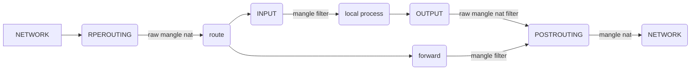
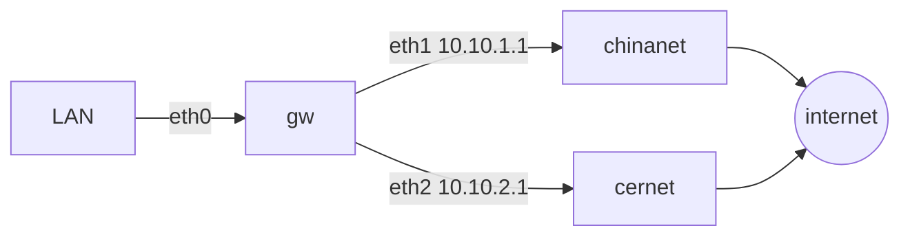

[TOC]
iptables 流向图



```
                                  netfilter hooks

                                  +-----------> local +-----------+
                                  |             process           |
                                  |                               |
                                  |                               |
                                  |                               |
                                  |                               v
  MANGLE            +-------------+--------+
  FILTER            |                      |               +----------------------+    RAW
  SECURITY          |        input         |               |                      |    conntrack
  SNAT              |                      |               |     output           |    MANGLE
                    +------+---------------+               |                      |    DNAT
                           ^                               +-------+--------------+    routing
                           |                                       |                   FILTER
                           |                                       |                   SECURITY
                           |            +---------------------+    |         +-------------+
     +-----------+                      |                     |    +-------> |             |
+--> |pre routing+----  route    -----> |      forward        |              |post routing +---->
     |           |      lookup          |                     +------------> |             |
     +-----------+                      +---------------------+              +-------------+
     
     RAW                                       MANGLE                         MANGLE
     conntrack                                 FILTER                         SNAT
     MANGLE                                    SECURITY
     DNAT
     routing
```

## 基本说明

### 表

| 优先级 | 表名       | 功能                  | 说明                          |
| :----- | :--------- | :-------------------- | ----------------------------- |
| 1      | raw        | 追踪                  | (connection tracking enabled) |
| 2      | mangle     | 分组                  |                               |
| 3      | nat (DNAT) | NAT |     (routing decision)                          |
| 4      | filter     | 过滤                  |                               |
| 5      | security   |                       |                               |
| 6      | nat (SNAT) | NAT                   |                               |

### 链

| 链名        | 作用                             |
| :---------- | :------------------------------- |
| INPUT       | 发往本机的报文                   |
| OUTPUT      | 由本机发出的报文                 |
| FORWARD     | 经由本机转发的报文               |
| PREROUTING  | 报文到达本机，进行路由决策之前   |
| POSTROUTING | 报文由本机发出，进行路由决策之后 |

### 动作

| 动作                              | 说明                 |
| :-------------------------------- | :------------------- |
| iptables -A                       | 添加规则             |
| iptables -D 2                     | 删除规则             |
| iptables -F                       | 删除所有规则         |
| iptables -I                       | 指定编号插入一个规则 |
| iptables -L                       | 列出指定链中所有规则 |
| iptables -t nat -vnL –line-number | 列出 NAT 表中规则    |
| iptables -N                       | 添加用户定义链       |
| iptables -X                       | 删除用户定义链       |
| iptables -P                       | 修改链的默认设置     |
| iptables -S                       | 显示命令历史         |

### 规则

| 规则            | 说明                 |
| :-------------- | :------------------- |
| -j DROP         | 拒绝                 |
| -j ACCEPT       | 允许                 |
| -j REJECT       | 拒绝并向返回         |
| -j LOG          | /var/log/messages    |
| –dport          | 指定目标端口         |
| –sport          | 指定源端口           |
| -p tcp          | 指定协议为 tcp       |
| -m mac –mac     | 绑定 MAC 地址        |
| -m limit –limit | 设置时间策列         |
| -s 10.10.0.0/16 | 指定源地址或地址段   |
| -d 10.10.0.0/16 | 指定目标地址或地址段 |

### 其他参数

- iptables -n -v -L -t filter 默认是使用易读的单位，也就是自动转化成M，G。如过需要Bytes做单位，则增加一个-x参数
- iptables -n -v -L -t filter -x

## TCPMSS

### mtu相关

修改mtu为1400

```
iptables -A FORWARD -p tcp -m tcp --tcp-flags SYN,RST SYN -j TCPMSS --set-mss 1400
```

设置mtu自动协商

```
iptables -I FORWARD -p tcp --tcp-flags SYN,RST SYN -j TCPMSS --clamp-mss-to-pmtu
```

## state

nf_conntrack(在老版本的 Linux 内核中叫 ip_conntrack)是一个内核模块,用于跟踪一个连接的状态的。连接状态跟踪可以供其他模块使用,最常见的两个使用场景是 iptables 的 nat 的 state 模块。 iptables 的 nat 通过规则来修改目的/源地址,但光修改地址不行,我们还需要能让回来的包能路由到最初的来源主机。这就需要借助 nf_conntrack 来找到原来那个连接的记录才行。而 state 模块则是直接使用 nf_conntrack 里记录的连接的状态来匹配用户定义的相关规则。例如下面这条 INPUT 规则用于放行 80 端口上的状态为 NEW 的连接上的包。

```
iptables -A INPUT -p tcp -m state --state NEW -m tcp --dport 80 -j ACCEPT。
```

iptables中的状态检测功能是由state选项来实现iptable的。对这个选项，在iptables的手册页中有以下描述：

```
state
```

这个模块能够跟踪分组的连接状态(即状态检测)。

格式：`--state XXXXX`

这里，state是一个用逗号分割的列表，表示要匹配的连接状态。

在iptables中有四种状态：`NEW，ESTABLISHED，RELATED，INVALID。`

- **NEW**，表示这个分组需要发起一个连接，或者说，分组对应的连接在两个方向上都没有进行过分组传输。NEW说明 这个包是我们看到的第一个包。意思就是，这是conntrack模块看到的某个连接第一个包，它即将被匹配了。比如，我们看到一个SYN包，是我们所留意 的连接的第一个包，就要匹配它。第一个包也可能不是SYN包，但它仍会被认为是NEW状态。比如一个特意发出的探测包，可能只有RST位，但仍然是 NEW。

- **ESTABLISHED**，表示分组对应的连接已经进行了双向的分组传输，也就是说连接已经建立，而且会继续匹配 这个连接的包。处于ESTABLISHED状态的连接是非常容易理解的。只要发送并接到应答，连接就是ESTABLISHED的了。一个连接要从NEW变 为ESTABLISHED，只需要接到应答包即可，不管这个包是发往防火墙的，还是要由防火墙转发的。ICMP的错误和重定向等信息包也被看作是 ESTABLISHED，只要它们是我们所发出的信息的应答。

- **RELATED**，表示分组要发起一个新的连接，但是这个连接和一个现有的连接有关，例如：FTP的数据传输连接 和控制连接之间就是RELATED关系。RELATED是个比较麻烦的状态。当一个连接和某个已处于ESTABLISHED状态的连接有关系时，就被认为 是RELATED的了。换句话说，一个连接要想是RELATED的，首先要有一个ESTABLISHED的连接。这个ESTABLISHED连接再产生一 个主连接之外的连接，这个新的连接就是RELATED的了，当然前提是conntrack模块要能理解RELATED。ftp是个很好的例子，FTP- data连接就是和FTP-control有RELATED的。还有其他的例子，

- **INVAILD**，表示分组对应的连接是未知的，说明数据包不能被识别属于哪个连接或没有任何状态。有几个原因可以产生这种情况，比如，内存溢出，收到不知属于哪个连接的ICMP错误信息。一般地，我们DROP这个状态的任何东西。

## mangle表

mangle表主要用于修改数据包的TOS(Type of Service, 服务类型)、TTL(Time To Live，生存周期)值以及为数据包设置Mark标记，以实现Qos(Quality Of Service，服务质量)调整以及策略路由等应用

## mark和connmark

关于mangle模块，内核里主要有三个功能模块：mark match、MARK target、CONNMARK target。

1. CONNMARK target

   | 选项                         | 功能                                   |
   | ---------------------------- | -------------------------------------- |
   | --set-mark value[/mask]      | 给链接跟踪记录打标记                   |
   | --save-mark [--mark mask]    | 将数据包上的标记值记录到链接跟踪记录上 |
   | --restore-mark [--mark mask] | 重新设置数据包的nfmark值               |

2. MARK target

   | 选项             | 功能                                  |
   | ---------------- | ------------------------------------- |
   | --set-mark value | 设置数据包的nfmark值                  |
   | --and-mark value | 数据包的nfmark值和value进行按位与运算 |
   | --or-mark value  | 数据包的nfmark值和value进行按位或运算 |

3. MARK match

   | 选项                    | 功能                                                   |
   | ----------------------- | ------------------------------------------------------ |
   | [!] --mark value[/mask] | 数据包的 nfmark值与value进行匹配，其中mask的值为可选的 |

> **CONNMARK和MARK的区别**
>
> 同样是打标记，CONNMARK是针对连接的，MARK是针对单一数据包的
>
> 两种机制一般都和ip rule联用，实现对满足一类条件的数据包的策略路由
>
> 1. 对连接打了标记，只是标记了连接，没有标记连接中的每个数据包。标记单个数据包，也不会对整条连接的标记有影响。二者是相对独立的
> 2. 路由判定(routing decision)是以单一数据包为单位的。或者说，在netfilter框架之外，并没有连接标记的概念。或者说，ip命令只知道MARK，而不知道CONNMARK是什么
> 3. 关键在于：给所有要进行ip rule匹配的单一数据包打上标记。方法一般有二：用MARK直接打，或者用CONNMARK --restore-mark把搭载连接上的标记转移到数据包上。

**mangle表工作流程**

1. iptable_mangle.c的主要工作就是注册和初始化mangle表，注册mangle钩子
2. 除了ct的hook是单独处理外，其他的filter、nat、mangle都是通过hook之后调用ipt_do_table来处理，要么重点在match里，要么重点在target处理中。但是这个基本机制框架没变。即都是通过rules。

先看一下target的执行

```
iptables -t mangle -A PREROUTING -i eth0 -p tcp --dport 80 -j MARK --set-mark 1
```

内核里对target MARK的处理代码

```c
// linux-5.10.55
static unsigned int
mark_tg(struct sk_buff *skb, const struct xt_action_param *par)
{
    const struct xt_mark_tginfo2 *info = par->targinfo;

    skb->mark = (skb->mark & ~info->mask) ^ info->mark;
    return XT_CONTINUE;
}
```

只是设置了`skb->mark`而已，没有改变报文内容。

mark match: 匹配mark非0的直接放通，mark为0的继续匹配下面的规则

```
iptables -A POSTROUTING -t mangle -m mark ! --mark 0 -j ACCEPT
```

MARK target: 设置标记

```
iptables -t mangle -A PREROUTING -i eth0 -p tcp --dport 80 -j MARK --set-mark 1
```

CONNMARK target:将mark打到连接跟踪记录上

```
iptables -A POSTROUTING -t mangle -j CONNMARK --save-mark
```

### 应用场景

1. 策略路由

要求对内网进行策略路由，所有通过TCP协议访问80端口的数据包都从ChinaNet线路出去，而所有访问UDP协议53端口对的数据包都从cernet线路出去



打标记

```
iptables -t mangle -A PREROUTING -i eth0 -p tcp --dport 80 -j MARK --set-mark 1
iptables -t mangle -A PREROUTING -i eth0 -p udp --dport 53 -j MARK --set-mark 2
```

<a name="1111111"></a>建表：

```
ip rule add from all fwmark 1 table 10
ip rule add from all fwmark 2 table 20
```

策略路由：

```
ip route add default via 10.10.1.1 dev eth1 table 10
ip route add default via 10.10.2.1 dev eth2 table 20
```

2. CONNMARK和MARK结合

```
iptables -A POSTROUTING -t mangle -j CONNMARK --restore-mark
iptables -A POSTROUTING -t mangle -m mark ! --mark 0 -j ACCEPT
iptables -A POSTROUTING -m mark --mark 0 -p tcp --dport 21 -t mangle -j MARK --set-mark 1
iptables -A POSTROUTING -m mark --mark 0 -p tcp --dport 80 -t mangle -j MARK --set-mark 2
iptables -A POSTROUTING -m mark --mark 0 -t mangle -p tcp -j MARK --set-mark 3 
iptables -A POSTROUTING -t mangle -j CONNMARK --save-mark
```

> 1. 第1条规则就是完成了将连接跟踪上的标记记录到该连接上的每一个数据包中
> 2. 第2条规则判断数据包的标记，如果不为0，则直接ACCEPT。如果数据包上没有被打标记，则交由后面的规则进行匹配并打标记。这里为什么会出现经过了CONNMARK模块，数据包仍未被打标记呢？可以想到，如果一条链接的第1个数据包经过第1条规则处理之后，由于ct->mark为0，所以其数据包的标记skb->nfmark应该仍旧为0，就需要进行后面规则的匹配。
> 3. 第3~5条规则，则按照匹配选项对符合规则的数据包打上不同的标记
> 4. 第6条规则，则是把之前打的标记信息保存到ct里.

## mac

以下命令将允许所有端口访问其物理地址 3E:D7:88:A6:66:8E

```
# iptables -I INPUT -m mac --mac-source 3E:D7:88:A6:66:8E -j ACCEPT
```

以下命令将允许SSH访问（端口22）具有物理地址 3E:D7:88:A6:66:8E。其他物理地址禁止访问SSH

```
# iptables -I INPUT -p tcp --port 22 -m mac ! --mac-source 3E:D7:88:A6:66:8E -j REJECT
```


## 其他命令

### iptables-save

dump 已配置的规则，可以用 > 重定向到一个文件中

参数

- -t 表示要dump的表(不指定的话dump所有表的配置)

- -c 表示输出中显示每条规则当前报文计数

```
iptables-save -t nat -c > iptables.save
```


### iptables-restore

从之前导出的iptable规则配置文件加载规则。

- -c 指定在还原iptables表时候，还原当前的数据包计数器和字节计数器的值 
- -t  指定要还原表的名称

还原iptables配置：

```
iptables-restore < iptables.save
```

指定在还原iptables表时候，还原当前的数据包计数器和字节计数器的值：

```
iptables-restore -c < iptables.save
```